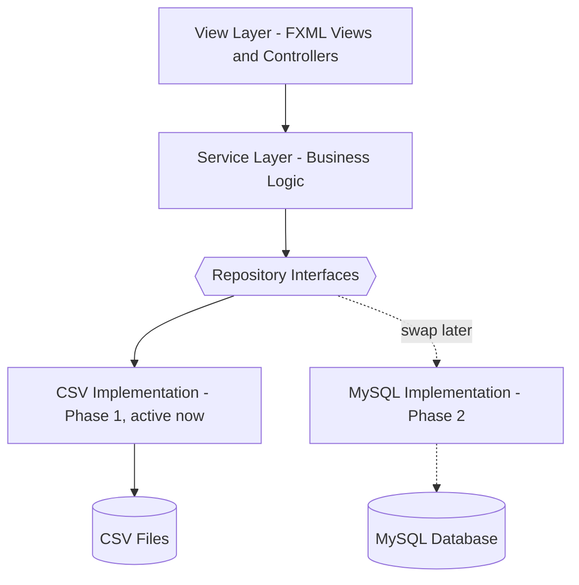
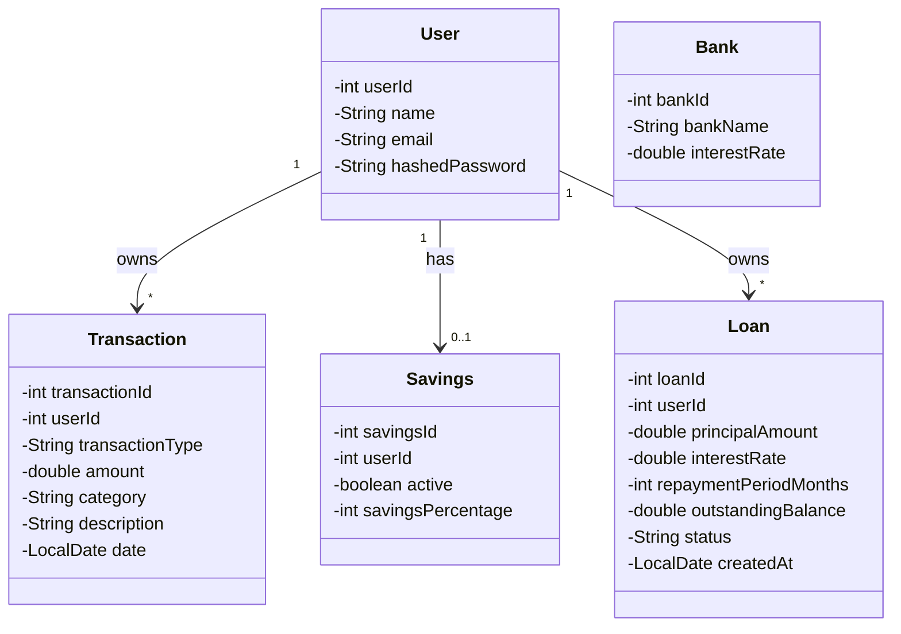
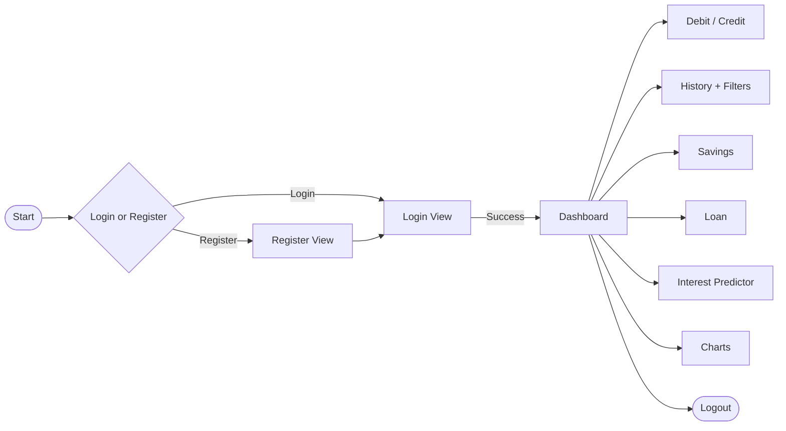

# Ledger System


A desktop personal finance ledger built for WIX1002 (Assignment Topic 2). Users register, log in, record debits and credits, track savings, take out loans, predict deposit interest, and view their transaction history with filtering, sorting, and charts.

## Table of Contents
- [Features](#features)
- [Tech Stack](#tech-stack)
- [Architecture](#architecture)
- [Data Model](#data-model)
- [Data Storage: CSV Now, Database Later](#data-storage-csv-now-database-later)
- [GUI Design](#gui-design)
- [Validation Rules](#validation-rules)
- [Project Structure](#project-structure)
- [Getting Started](#getting-started)
- [Development Roadmap](#development-roadmap)
- [Open Design Questions](#open-design-questions)
- [Team](#team)

## Features

**Core (8 marks)**
- [x] User registration and login
- [x] Record debit and credit transactions
- [x] Savings with auto-transfer at month end
- [x] View account balance
- [x] Transaction history by month
- [x] Logout
- [x] Credit loan (apply and repay)
- [x] Deposit interest predictor

**Extra features (all 5)**
- [x] Filtering and sorting on history
- [x] Graphical user interface (JavaFX)
- [x] Password hashing (bcrypt)
- [x] Data visualization with charts
- [x] Loan repayment reminder system

## Tech Stack

| Layer | Choice | Why |
| --- | --- | --- |
| Language | Java 21 | Course requirement |
| GUI | JavaFX (FXML + CSS) | Modern successor to Swing. Separates layout (FXML) and styling (CSS) from logic, closer to how real frontend teams work, and gives you exposure to a more current toolkit. Ships with its own chart components (PieChart, LineChart, BarChart), which covers the Data Visualization extra without a third-party library. |
| Build tool | Maven | Manages the JavaFX and bcrypt dependencies, standard for real Java projects |
| Storage (Phase 1) | CSV files | Matches the brief, no server setup needed while the rest of the app is built |
| Storage (Phase 2) | MySQL | Free, lightweight local setup (MySQL Community Server), huge documentation base, and the database most commonly used in student and industry projects. Oracle works too if your course specifically requires it, but it is heavier to install locally for no real benefit here. |
| Password hashing | jBCrypt | Simple, well-known bcrypt wrapper for Java |

JavaFX needs one extra setup step Swing would not: since Java 11 it is not bundled with the JDK, so it is added as a Maven dependency (`org.openjfx:javafx-controls`, `javafx-fxml`) plus a small Maven plugin to run it. IntelliJ handles this without much friction once `pom.xml` is set up.

## Architecture

Four layers. The important part for the CSV-to-database plan: the Service layer talks to repository *interfaces*, never to CSV or SQL code directly. That is what lets you swap the storage implementation later without touching business logic or the GUI.



| Layer | Job | Never does |
| --- | --- | --- |
| View (FXML + Controllers) | Show screens, collect input, display results and charts | Calculate balances, read/write data |
| Service | Validation, calculations, business rules | Know about FXML or UI components |
| Repository (interface) | Define what data operations exist | Care which storage is behind it |
| Repository (CSV impl) | Read/write CSV files, generate IDs | Contain business logic |
| Repository (MySQL impl, Phase 2) | Run SQL against MySQL | Contain business logic |

## Data Model



`Transaction` gets a `category` field (Food, Rent, Transport, Other, and so on) beyond what the brief listed, since the pie chart requirement asks for spending distribution "by category" and there is nothing else in the data to group by otherwise.

Balance rule, matching the sample transcript in the brief: `balance = sum(debit amounts) - sum(credit amounts)`. Debit is money in and credit is money out in this assignment's own terms, the reverse of formal accounting language, worth a code comment so nobody "corrects" it later.

## Data Storage: CSV Now, Database Later

**Phase 1, CSV files:**

| File | Columns |
| --- | --- |
| `users.csv` | user_id, name, email, password_hash |
| `transactions.csv` | transaction_id, user_id, type, amount, category, description, date |
| `savings.csv` | savings_id, user_id, active, percentage |
| `loans.csv` | loan_id, user_id, principal_amount, interest_rate, repayment_period_months, outstanding_balance, status, created_at |
| `banks.csv` | bank_id, bank_name, interest_rate (seeded once with the 6 banks from the brief) |

**Phase 2, MySQL:** each CSV file becomes a table with the same columns, plus real foreign keys (`transactions.user_id` references `users.user_id`, and so on) and auto-increment primary keys instead of the manual "max ID plus one" logic the CSV version needs. Migration means writing a `MySql*Repository` class per entity behind the same interface as the CSV version, then pointing the app at it. No changes needed in `service/` or `controller/`.

## GUI Design



The dashboard uses one main window with views swapped in and out of a center pane, rather than a new window per screen. The Charts view has three tabs: spending distribution by category (pie chart), balance trend over time (line chart), and loan repayment progress (bar chart), all using JavaFX's built-in `javafx.scene.chart` package. A reminder banner appears on the dashboard if a loan is overdue, checked once at login.

## Validation Rules

| Field | Rule |
| --- | --- |
| Email | Standard format, name@domain.com |
| Password | Minimum 8 characters, at least one letter, one digit, one special character |
| Confirm password | Must match password exactly |
| Name | Letters, numbers, and spaces only |
| Transaction amount | Positive, and below a set ceiling (e.g. 1,000,000) |
| Transaction date | Auto-recorded as today, never in the future |
| Description | Max 100 characters |

## Project Structure

```
LedgerSystem/
├── pom.xml
├── data/
│   ├── users.csv
│   ├── transactions.csv
│   ├── savings.csv
│   ├── loans.csv
│   └── banks.csv
├── src/
│   └── main/
│       ├── java/
│       │   └── com/ledgersystem/
│       │       ├── Main.java
│       │       ├── model/
│       │       │   ├── User.java
│       │       │   ├── Transaction.java
│       │       │   ├── Savings.java
│       │       │   ├── Loan.java
│       │       │   └── Bank.java
│       │       ├── repository/
│       │       │   ├── UserRepository.java
│       │       │   ├── TransactionRepository.java
│       │       │   ├── SavingsRepository.java
│       │       │   ├── LoanRepository.java
│       │       │   ├── BankRepository.java
│       │       │   └── csv/
│       │       │       ├── CSVManager.java
│       │       │       ├── CsvUserRepository.java
│       │       │       ├── CsvTransactionRepository.java
│       │       │       ├── CsvSavingsRepository.java
│       │       │       ├── CsvLoanRepository.java
│       │       │       └── CsvBankRepository.java
│       │       ├── service/
│       │       │   ├── AuthService.java
│       │       │   ├── LedgerService.java
│       │       │   ├── SavingsService.java
│       │       │   ├── LoanService.java
│       │       │   ├── InterestPredictorService.java
│       │       │   ├── HistoryService.java
│       │       │   └── ChartService.java
│       │       ├── controller/
│       │       │   ├── LoginController.java
│       │       │   ├── RegisterController.java
│       │       │   ├── DashboardController.java
│       │       │   ├── TransactionController.java
│       │       │   ├── HistoryController.java
│       │       │   ├── SavingsController.java
│       │       │   ├── LoanController.java
│       │       │   ├── PredictorController.java
│       │       │   └── ChartsController.java
│       │       └── util/
│       │           ├── Validator.java
│       │           ├── PasswordHasher.java
│       │           ├── SessionManager.java
│       │           └── CSVExporter.java
│       └── resources/
│           └── com/ledgersystem/
│               ├── fxml/
│               │   ├── login.fxml
│               │   ├── register.fxml
│               │   ├── dashboard.fxml
│               │   ├── transaction.fxml
│               │   ├── history.fxml
│               │   ├── savings.fxml
│               │   ├── loan.fxml
│               │   ├── predictor.fxml
│               │   └── charts.fxml
│               └── css/
│                   └── style.css
└── README.md
```

`repository/` holds the interfaces at the top level and the CSV implementations in `repository/csv/`. When Phase 2 starts, a `repository/mysql/` package gets added alongside it, same interfaces, different implementation.

## Getting Started

**Prerequisites:** JDK 17+ (Project targets Java 21), IntelliJ IDEA, Maven (bundled with IntelliJ).

1. Clone the repo and open it in IntelliJ as a Maven project.
2. Let IntelliJ download dependencies from `pom.xml` (JavaFX, jBCrypt).
3. Run `Main.java`.
4. The `data/` folder is created with empty CSVs on first run if it doesn't exist yet.

## Development Roadmap

**Phase 1: Core features on CSV**
1. Model classes
2. Repository interfaces and CSV implementations, tested by printing loaded rows
3. `AuthService` plus login and register views
4. `LedgerService` plus debit/credit view and balance display
5. `HistoryService` plus history view (table first, then filters, sort, export)
6. `SavingsService` plus savings view
7. `LoanService` plus loan view and overdue check

**Phase 2: Remaining extras**
8. `InterestPredictorService` plus predictor view
9. Reminder banner on login
10. `ChartService` plus charts view (pie, line, bar)
11. Polish: validation messages, empty states, confirmation dialogs

## Open Design Questions

Worth confirming with your groupmate or lecturer before you build these:
- **Loan repayment formula.** The brief just says "calculate total repayment based on principal and interest rate." A reasonable default: `totalRepayment = principal + (principal * interestRate/100 * repaymentPeriodMonths/12)`.
- **Savings percentage scope.** The brief says the percentage applies "to the next debit," which reads as one-time. This plan applies it to every debit going forward once activated, since a one-time deduction is an odd feature to build a whole settings screen for.

## Team
- Tanvir Hossain
- *(add your groupmates here)*
